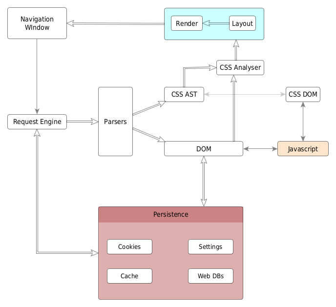

# High-level Overview

This is a very abstract and high-level overview of `gngr`. Probably also applicable to most other browsers.

## Typical flow

1. User enters a `URL` in the `Navigation Window`
2. `Request Engine` fetches the `URL` and the content is passed to the appropriate parser. The `Request Engine` uses the
`Persistence` modules to get/set the cookies, and to cache requests.
3. Any dependent resources are fetched as well (Images, CSS, Frames, etc) through the `Request Engine`.
4. After parsing, an `HTML DOM` or `CSS AST` is created in memory.
5. The HTML DOM and CSS AST are used by the `layout` and `rendering` modules to display content back on the `Navigation Window`.
6. The `Javascript` engine allows scripts to interact with the `DOM` and `CSS DOM` APIs.
